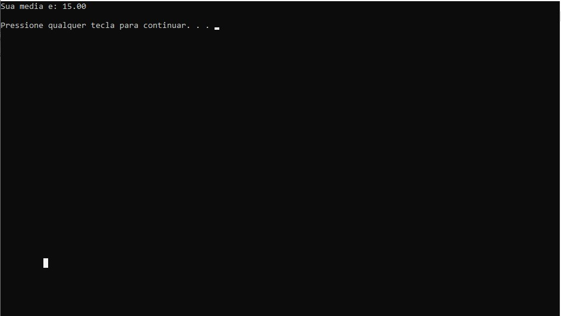

# Media do Aluno
.
<h2>ATIVIDADE</h2>

Atividade para calcular a media de duas notas do aluno. No início pergunta a primeira nota e depois a segunda nota, quando aperta "enter" é mostrado
a média do aluno.

<h2>Tecnologias</h2>

- C 

- GIT e GitHub 

<h2>Contato</h2>

viktorariel777@gmail.com

